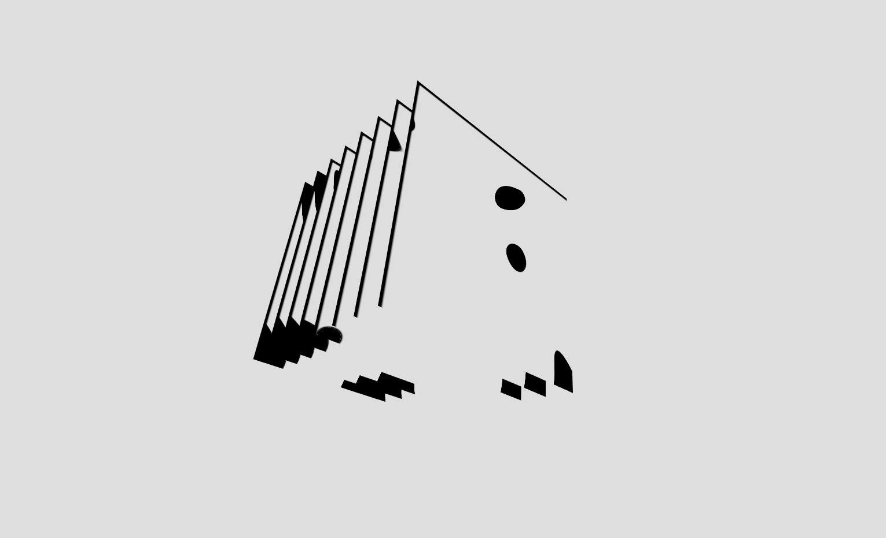

# p5-stacked-shaders-perlin-contours-webmaeistro-easycam-branch
A 3d sketch showing a stack of 2d pixel-shaded plates each rendering perlin noise contours at a different phase offset - simulates slices of a 3d volume.

Warning: This is by a 3D and Shader newbie.  There are almost certainly a lot of bad practices here! >>>-fixed

>>removed the orbitControl, gave it a easyCam with custom library for a little smoother spinning experience. 

>>played with directional,ambient and pointlights - combined with the texture it kinda just got the apperance of "dirty-milk" :D

>>- i love where you where going idea wise, major props for this @nbogie ! 

